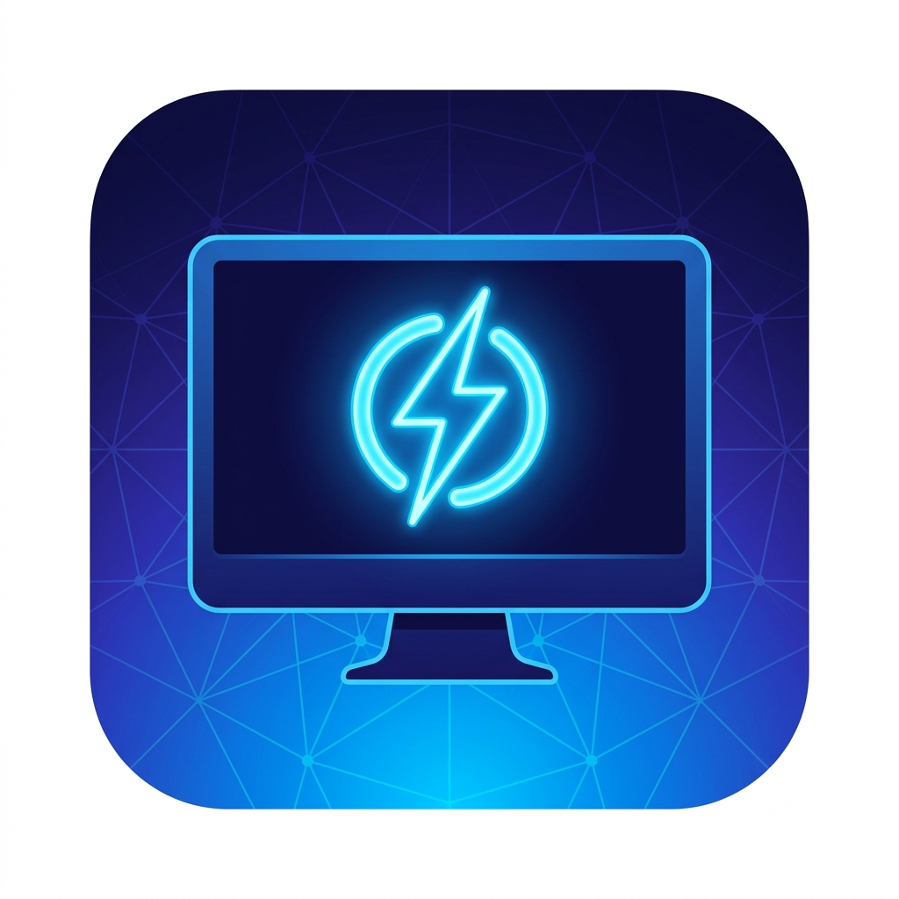

# ⚡ GridAwake

<p align="center">
  
</p>

**GridAwake** — это современная, быстрая и удобная система для удалённого управления вашим компьютером (ПК) прямо с iPhone. Она позволяет включать компьютер по сети (Wake-on-LAN) и полностью управлять питанием и звуком через лёгкий фоновый агент.

* **Разработчик:** [Abstrackt](https://github.com/Abstrackt)

---

## 📱 Основные возможности
* **Удалённое включение (Wake-on-LAN)**: включение ПК по локальной сети из выключенного состояния или режима сна.
* **Управление питанием**: выключение, перезагрузка, спящий режим и гибернация.
* **Таймер отложенного действия**: удерживайте любую кнопку в приложении, чтобы запланировать действие на потом (например, выключить ПК через 30 минут).
* **Управление громкостью**: регулировка общего уровня громкости Windows с помощью слайдера в реальном времени, а также кнопка быстрого отключения звука.
* **Быстрое сопряжение по QR-коду**: агент на ПК генерирует QR-код со всеми сетевыми параметрами (IP, порт, MAC-адрес) — просто отсканируйте его камерой iPhone, чтобы добавить устройство.
* **Красивый интерфейс**: поддержка тем оформления (Океан, Полночь, Cyberpunk, Лес, Сакура) и темной/светлой темы iOS.

---

## ⚙️ Архитектура системы
```
iPhone App (SwiftUI)
    │
    ├──► Wake-on-LAN (UDP порт 9, broadcast)    ← Увімкнути ПК (Magic Packet)
    │
    └──► HTTP REST API → PC Agent (:7070)        ← Вимкнути / Перезапустити / Сон / Гучність
              │
              └── Windows: командная строка (shutdown), регулировка громкости (CoreAudio)
```

> ⚠️ **Важно:** Ваш iPhone и ПК должны быть подключены к **одной Wi-Fi/локальной сети**.

---

## 🖥️ 1. Настройка PC Agent (Windows)

Агент написан на Python и работает в фоновом режиме (в трее).

### Требования
* Windows 10 / 11
* Python 3.10+ (обязательно отметьте `Add Python to PATH` при установке)

### Быстрый запуск для разработчиков
1. Перейдите в папку агента:
   ```powershell
   cd pc-agent
   ```
2. Установите зависимости:
   ```powershell
   pip install -r requirements.txt
   ```
3. Запустите агент:
   ```powershell
   python main.py
   ```
4. В системном трее появится иконка **⚡ GridAwake**. Нажмите на неё правой кнопкой мыши и выберите **«Настройки»**, чтобы увидеть QR-код для подключения приложения на iPhone.

### Сборка готового `.exe` файла
Чтобы агент запускался без установленного Python:
1. Выполните сборку:
   ```powershell
   .\build.bat
   ```
2. Готовый файл появится по пути: `dist/GridAwake/GridAwake.exe`
3. Чтобы добавить программу в автозапуск Windows, нажмите `Win+R`, введите `shell:startup` и перетащите ярлык `.exe` в открывшуюся папку.

---

## 📱 2. Установка приложения на iPhone

Поскольку вы собираете приложение самостоятельно, самый простой и бесплатный способ для Windows-пользователей — сборка через **GitHub Actions** и установка через **Sideloadly**.

### Шаг 2.1 — Загрузка вашего кода на GitHub
1. Создайте новый публичный репозиторий на [github.com/new](https://github.com/new) с именем `GridAwake`.
2. Запустите скрипт настройки GitHub из папки проекта:
   ```powershell
   .\github-deploy\push_to_github.bat
   ```
3. Скрипт поможет вам инициализировать Git и загрузить ваш код на GitHub.

### Шаг 2.2 — Сборка IPA
1. Перейдите в ваш репозиторий на GitHub во вкладку **Actions**.
2. Слева выберите workflow **«📱 GridAwake iOS — Build IPA»**.
3. Нажмите **Run workflow** → **Run workflow**.
4. После окончания сборки (около 10-15 минут, загорится зеленая галочка) прокрутите страницу вниз и в блоке **Artifacts** скачайте архив с файлом `.ipa`. Распакуйте его.

### Шаг 2.3 — Установка через Sideloadly (или 3uTools)
1. Установите на ПК официальную web-версию **iTunes** ([скачать 64-bit](https://www.apple.com/itunes/download/win64)).
2. Установите **Sideloadly** ([sideloadly.io](https://sideloadly.io/)).
3. Подключите iPhone к ПК по кабелю, разблокируйте его и выберите **«Доверять этому компьютеру»**.
4. Откройте Sideloadly, перетащите ваш `GridAwake.ipa` в левую панель.
5. Введите ваш **Apple ID** (почту от iCloud) и нажмите **Start**.
6. После завершения установки (**Done**) откройте на iPhone: **Настройки → Основные → VPN и управление устройством** → выберите ваш Apple ID → нажмите **«Доверять»**.
7. *(Для iOS 16+)* Также включите: **Настройки → Конфиденциальность и безопасность → Режим разработчика** (включить и перезагрузить устройство).

---

## 🔌 Режим Wake-on-LAN (BIOS & Windows)

Чтобы компьютер реагировал на сигнал включения:
1. **Настройка BIOS**: во время перезагрузки компьютера зажмите `Del` или `F2`. Найдите вкладку **Power Management** (или **Advanced**) и включите функции `Wake-on-LAN`, `Power On By PCI-E`, `Resume by LAN` или аналогичные. Сохраните изменения (`F10`).
2. **Настройка сетевой карты в Windows**:
   * Нажмите `Win+X` → **Диспетчер устройств**.
   * Разверните **Сетевые адаптеры**, дважды кликните по вашей сетевой плате (Ethernet).
   * Перейдите во вкладку **Управление электропитанием** и отметьте галочкой пункт **«Разрешить этому устройству выводить компьютер из режима ожидания»**.

---

## 💬 Поддержка и обратная связь
Если у вас возникли трудности с настройкой сети или сборкой приложения, присоединяйтесь к нашему дискорд-серверу:  
👉 **[Discord Server GridAwake](https://dsc.gg/gridawake)**
